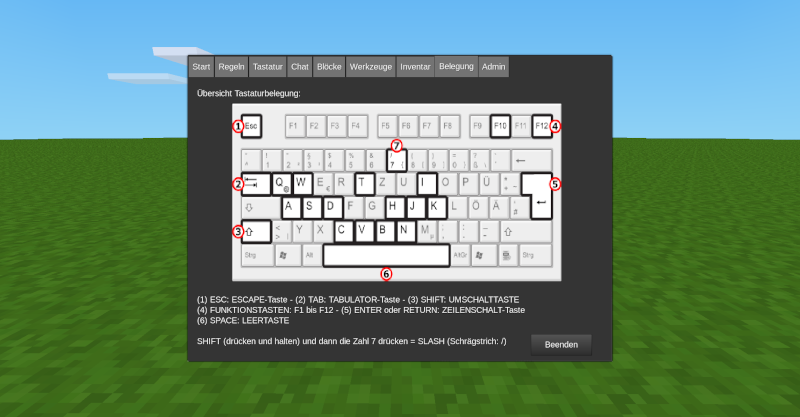

# Hilfe Mod

Im Mod »hilfe« findet man die wichtigsten Tastaturbefehle, Blöcke und Funktionen von Minetest erklärt. Aufruf im Chat mit /hilfe oder über das Inventar (Fragezeichen-Icon).

Der Hilfetext kann leicht in der init.lua-Datei den eigenen Bedürfnissen angepasst werden.

This mod helps new users understand Minetest (at the moment only german language). You can change easily the help text in the init.lua file.
## [download](https://github.com/mmmsued/hilfe)

