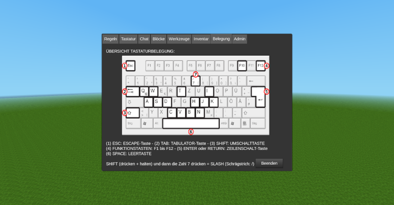

# Hilfe Mod

**BESCHREIBUNG:**
Im Mod »hilfe« findet man die wichtigsten Tastaturbefehle, Blöcke und Funktionen von Minetest/Luanti erklärt. Aufruf im Chat mit /hilfe oder über das Inventar (Fragezeichen-Icon – falls »[unified_inventory](https://content.luanti.org/packages/RealBadAngel/unified_inventory/)« installiert ist). Der Hilfetext kann leicht in der init.lua-Datei den eigenen Bedürfnissen angepasst werden.

**DESCRIPTION:**
This mod helps beginners to understand Minetest/Luanti (currently only in German language).

**USE**:
Open it via chat with /hilfe or look for the question mark in the inventory (if »[unified_inventory](https://content.luanti.org/packages/RealBadAngel/unified_inventory/)« is installed). You can change easily the help text in the init.lua file.

**DEPENDS:**
This mod requires no other mods to work correctly. Optional dependencies are »[unified_inventory](https://content.luanti.org/packages/RealBadAngel/unified_inventory/)« and »[inventory_plus](https://content.luanti.org/packages/TenPlus1/inventory_plus/)«.

**LICENSE:**  
Author: This mod was made by [Norbert Thien, multimediamobil – Region Süd (mmmsued)](https://minetest-modding.weebly.com/), 2025   
Code: Except otherwise specified, all code in this project is licensed as LGPLv3.  
Media: Except otherwise specified, all media and any other content in this project which is not source code is licensed as CC BY SA 3.0.
